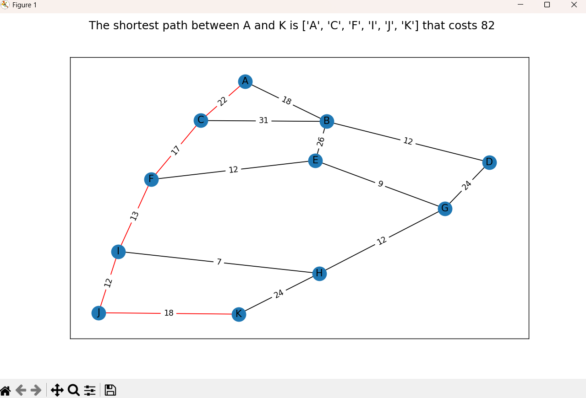

# GraphePython

**GraphePython** is an implementation of Dijkstra's algorithm to find the shortest path in an undirectedted graph. This project allows you to easily create graphs and find the shortest path. It also supports a graphic visualisation.

## Functionalities

- Creation of graphs with nodes and weighted edges
- Search of the shortest path in a non oriented graph
- Support graph visualisation with networkx and matplotlib

### Prerequisites

- Python 3.7 or higher
- You must have the following libraries installed :
    - `matplotlib`
    - `networkx`

## Installation

You can install **GraphePython** via pip by running the following command :

```bash
pip install GraphePython
```

### Tests

If you to run some tests to check if the module is working correctly, you can use the tests in the tests folder and run the following command :

```bash
python -m unittest discover tests
```

## Exemple codes

To use **GraphePython**, you first have to import it and create a new graph :
```python
import GraphePython as gp

graph = gp.Graph()
```

The next step is to add nodes to your graph. You can either add them one by one or from an array :

```python
graph.add_node("A") # Adding a single node
graph.add_nodes_from_array(["B", "C", "D", "E", "F", "G", "H", "I", "J", "K"]) # Adding all the nodes from B to K at once
```

Now that you have multiple nodes you can connect them by adding edges. Unlike nodes, edges can only be added one at a time :

```python
graph.add_edge("A", "B", 18) # Adds an edge from A to B (and from B to A) with a weight (or cost) of 18
graph.add_edge("A", "C", 22)
graph.add_edge("B", "C", 31)
graph.add_edge("C", "F", 17)
graph.add_edge("B", "E", 26)
graph.add_edge("B", "D", 12)
graph.add_edge("E", "F", 12)
graph.add_edge("D", "G", 24)
graph.add_edge("H", "G", 12)
graph.add_edge("H", "I", 7)
graph.add_edge("H", "K", 24)
graph.add_edge("K", "J", 18)
graph.add_edge("I", "J", 12)
graph.add_edge("F", "I", 13)
graph.add_edge("G", "E", 9)
```

Finally you can get the shortest path between two nodes :

```python
graph.get_path("A", "K", draw=False) # Returns the shortest path between A and K in an array here : ['A', 'C', 'F', 'I', 'J', 'K']
```

You can also see your graph by setting the draw input to True or by calling the draw graph function :

```python
graph.get_path("A", "K", draw=True) # Returns the shortest path and shows it in a Matplotlib window
graph.draw_graph(path = [], path_text = "Graph title") # This creates a new window. You can provide any path you want and it will be highlighted in red (e.g : ['A', 'B', 'E']) You can also provide a text that will be displayed above the graph in the window.
```

This should give you something like this :



## License

This project is licensed under the MIT License - see the [LICENSE](LICENSE) file for details.
